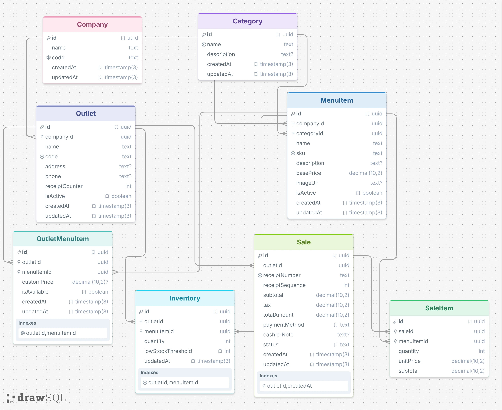

# Architecture & System Design

This document explains the architecture, database design, scaling plan, microservices transition, and offline strategy for the Techzu Multi-Outlet Point of Sale (POS) system.

---

## 1. Database Design & Entity-Relationship Diagram (ERD)

The system runs on **PostgreSQL 16** and uses **Prisma 7** as the data layer. 

Here is how the data is structured and how the different models connect:



### Key Database Rules & Integrity Checks

1. **Sequential, Gapless Receipt Numbers**:
   - Every outlet has its own `receiptCounter`.
   - When an order is placed, we lock the outlet row using PostgreSQL's `SELECT ... FOR UPDATE` inside a database transaction, increment the counter, and generate the receipt ID (for example, `RCP-TECHZU-DHAN-20260923-000001`).
   - This ensures two cashiers submitting sales at the exact same millisecond never get duplicate or skipped receipt numbers.

2. **Negative Stock Prevention (Two Levels of Defense)**:
   - **Database Level**: A PostgreSQL check constraint enforces that stock cannot drop below zero:
     ```sql
     ALTER TABLE "Inventory" ADD CONSTRAINT chk_inventory_non_negative CHECK (quantity >= 0);
     ```
   - **Application Level**: During checkout, the deduction query only updates rows where sufficient stock exists:
     ```sql
     UPDATE "Inventory" 
     SET quantity = quantity - $qty 
     WHERE "outletId" = $outletId AND "menuItemId" = $itemId AND quantity >= $qty 
     RETURNING quantity;
     ```
   - If any item in the order has insufficient stock, the whole transaction rolls back cleanly and returns a clear error message.

3. **Preventing Duplicates**:
   - `OutletMenuItem` has a unique constraint on `(outletId, menuItemId)` so a menu item cannot be assigned twice to the same outlet.
   - `Inventory` also has a unique constraint on `(outletId, menuItemId)` so each outlet keeps a single stock record per item.

---

## 2. Scaling Plan (10 Outlets, 100,000 Transactions / Month)

### Expected Load Breakdown
- **Monthly Transactions**: 100,000 across 10 outlets.
- **Daily Average**: ~3,333 orders per day total (around ~330 orders per outlet per day).
- **Peak Hours (Lunch & Dinner Rushes)**: Even if 80% of sales happen within a 4-hour window, the system handles roughly **0.2 to 2 orders per second** overall, with occasional bursts of **10 to 20 orders per second**.
- **Yearly Data Growth**:
  - ~1.2 million `Sale` records per year.
  - ~3.6 million `SaleItem` rows per year (assuming an average of 3 items per order).

PostgreSQL handles this volume comfortably on modest hardware. Here is how we ensure smooth performance as traffic grows:

---

### A. Database Scaling

1. **Connection Pooling with PgBouncer**:
   - Instead of letting every backend process or terminal keep a separate connection open to PostgreSQL, we put **PgBouncer** in front of the database in transaction pooling mode.
   - This keeps memory usage low and prevents the database from running out of connections during traffic spikes.

2. **Splitting Reads and Writes (Read Replicas)**:
   - **Primary Database**: Handles all writes—checkouts, inventory changes, and receipt updates.
   - **Read Replicas**:
     - *Replica 1*: Serves the POS terminal catalog lookups (`GET /assignments/:outletId/menu`), which make up over 90% of requests.
     - *Replica 2*: Serves heavy HQ analytical reports (`GET /reports/*`), ensuring that long-running manager queries never slow down cashier checkouts.

3. **Monthly Table Partitioning**:
   - As sales records grow into millions of rows, we partition the `Sale` and `SaleItem` tables by month (`createdAt`):
     ```sql
     CREATE TABLE "Sale" (...) PARTITION BY RANGE ("createdAt");
     CREATE TABLE "Sale_2026_09" PARTITION OF "Sale"
       FOR VALUES FROM ('2026-09-01') TO ('2026-10-01');
     ```
   - Normal daily POS queries only search the current month's active partition, keeping database indexes small, fast, and cached in RAM. Old historical partitions can be archived cleanly without downtime.

---

### B. Keeping Reports Fast

1. **Targeted Indexes**:
   - Indexes on `Sale("outletId", "createdAt")` and `SaleItem("saleId", "menuItemId")` keep report queries under 5 milliseconds.
2. **Pre-calculated Views (Materialized Views)**:
   - For daily and hourly totals, we use a PostgreSQL Materialized View:
     ```sql
     CREATE MATERIALIZED VIEW mv_daily_outlet_revenue AS
     SELECT 
       s."outletId",
       DATE_TRUNC('day', s."createdAt") AS sale_date,
       SUM(s."totalAmount") AS gross_revenue,
       COUNT(s.id) AS total_orders
     FROM "Sale" s
     WHERE s.status = 'COMPLETED'
     GROUP BY s."outletId", DATE_TRUNC('day', s."createdAt");
     ```
   - Refreshing this in the background (every 5–15 minutes) means HQ managers get instant dashboard graphs without recalculating millions of sales on every page refresh.
3. **Dedicated Analytics Store (Future Growth)**:
   - Once data crosses tens of millions of records, sales events can be streamed to a columnar database like **ClickHouse** or **BigQuery** for multi-year trend queries across hundreds of stores.

---

### C. Infrastructure Considerations

1. **Auto-Scaling Containers**:
   - Run the backend on container platforms (Kubernetes or AWS ECS) with auto-scaling that spins up more instances during lunch and dinner rushes.
2. **Caching the Menu Catalog**:
   - Menus and prices change rarely compared to sales. Caching `GET /assignments/:outletId/menu` in **Redis** or a CDN edge with instant invalidation on price updates eliminates over 80% of routine database reads.

---

### D. Architectural Evolution (Event-Driven)

- Shift from doing everything during checkout to publishing events:
  - When an order completes, the backend publishes an `OrderCompleted` event to a lightweight broker (RabbitMQ or Redis Streams).
  - Background workers handle secondary tasks—sending digital receipts, updating analytics dashboards, and alerting managers when stock gets low.

---

## 3. Conversion to Microservices

As Techzu POS expands to 50+ locations, hundreds of cashier terminals, and multiple engineering teams, the modular monolith can naturally split into smaller microservices.

---

### A. Why and When to Transition

Transitioning from a modular monolith to microservices is not merely a technical exercise—it is driven by distinct business and operational bottlenecks:

| Evolutionary Driver | Monolithic Bottleneck | Microservices Solution |
| :--- | :--- | :--- |
| **Independent Scalability** | Catalog browsing is 95% read traffic, while Checkout is 100% write-intensive ACID transactions. Scaling the monolith scales both together, wasting compute. | Scale read-heavy Catalog independently on lightweight containers with edge CDN caching, while Order Service gets high-memory, dedicated CPU instances. |
| **Fault Domain Isolation** | A CPU-heavy analytical query (`GET /reports/overview`) or an external SMS receipt gateway timeout can block the Node.js event loop, freezing POS cashier checkouts. | Complete blast-radius isolation: Even if Reporting or Notification services crash, POS terminals continue checkout transactions with zero disruption. |
| **Team Autonomy (Conway’s Law)** | Multiple engineering squads (POS Team, Menu & Catalog Team, Finance & BI Team) modifying a single codebase face Git merge conflicts and deployment contention. | Independent repositories, CI/CD pipelines, and semantic versioned API contracts per bounded domain. |
| **Polyglot Persistence** | Monolith forces all domain entities into a single PostgreSQL relational engine. | Polyglot persistence: PostgreSQL for ACID transactions, Redis for distributed locks/session caching, ClickHouse for petabyte-scale reporting. |

---

### B. Microservices System Tiers & Architecture Flow

Instead of a single monolithic server, the microservices architecture is structured into 4 clean tiers:

#### Tier 1: Client Applications
- **HQ Admin Portal (React / Vite)**: Used by executives to manage master menus, assign outlet prices, and view company analytics.
- **Outlet POS Terminals (Desktop / Web)**: Used by store cashiers to take orders, ring up sales, and print receipts.
- **Kitchen Display Systems (KDS)**: Screens in the kitchen showing live food preparation tickets.

#### Tier 2: API Gateway & Edge Security (Kong or Envoy)
- Single entry point for all external traffic.
- Handles user authentication (JWT tokens), SSL termination, rate-limiting, and routes requests to the correct internal service (`/menu/*` $\rightarrow$ Catalog Service, `/orders/*` $\rightarrow$ Order Service, etc.).

#### Tier 3: Independent Domain Services
1. **Catalog & Menu Service**: Runs on lightweight containers with its own PostgreSQL database and Redis cache for fast menu lookups.
2. **Order & Checkout Service**: The high-priority core engine backed by a dedicated PostgreSQL database optimized for atomic write transactions.
3. **Inventory Service**: Manages outlet stock levels and deductions with fast distributed locking.
4. **Outlet & Org Service**: Stores static branch details, tax configurations, and employee accounts.
5. **Reporting & BI Service**: Backed by a high-speed columnar database (like ClickHouse) to run complex analytics across millions of historical rows without touching checkout databases.
6. **Notification Service**: Background worker connecting to external SMS, WhatsApp, and email providers for digital receipts.

#### Tier 4: Distributed Event Bus (Kafka / RabbitMQ)
Services talk to each other asynchronously through events instead of blocking HTTP calls:
- When an order is placed: **Order Service** emits `orders.placed`.
- **Inventory Service** consumes the event to deduct stock.
- **Kitchen Display (KDS)** receives the event to display the food ticket in real time.
- **Notification Service** picks up the event to dispatch the SMS/email receipt.
- **Reporting Service** streams the order into the analytics warehouse.

---

### C. Which Components Should Be Separated & Why

We separate the system around natural business boundaries:

#### 1. Catalog & Menu Service
- **What it handles**: Master food items, categories, SKUs, base prices, outlet assignments, and outlet price overrides.
- **Why separate it**:
  - **Read-heavy**: Customers and cashiers view menus all day, but managers only update prices occasionally.
  - **Easy to cache**: Menus can be heavily cached in Redis or a CDN, cutting database load significantly without affecting sales transactions if menu editing is temporarily down.

#### 2. Order & Checkout Service (The Core Engine)
- **What it handles**: Cart totals, tax calculations, sequential receipt numbering (`RCP-{OUTLET}-{SEQ}`), payments (Cash, Card, QRIS/Mobile Pay), and sales records.
- **Why separate it**:
  - **High priority**: This service directly affects revenue and must never go down.
  - **Isolated transaction workload**: Separating it ensures that a heavy manager report running in the background never slows down a customer waiting to pay at the register.

#### 3. Inventory & Stock Service
- **What it handles**: Current stock per outlet, deductions on sale, low-stock alerts, and restocking logs.
- **Why separate it**:
  - **High competition for items**: During lunch rushes, several cashiers might sell the last few portions of the same dish at once. Keeping inventory isolated lets it use focused concurrency locks without locking the entire database.

#### 4. Outlet & Organization Service
- **What it handles**: Company info, outlet branches, device registrations, and store operating hours.
- **Why separate it**:
  - This is mostly static reference data. Separating it keeps store setup logic decoupled from fast-moving transaction logic.

#### 5. Reporting & Analytics Service
- **What it handles**: Revenue by outlet, top-selling dishes, daily totals, and business intelligence.
- **Why separate it**:
  - **Heavy resource usage**: Running queries like `SUM(totalAmount)` over thousands of sales takes serious CPU and memory. Keeping reporting on its own prevents it from slowing down cashier checkouts.

#### 6. Notification & Digital Receipt Service
- **What it handles**: Sending SMS, WhatsApp, or email receipts, plus notifying managers when stock is low.
- **Why separate it**:
  - External SMS or email providers can be slow or experience outages. By handling these in a background service, cashiers never have to wait for an external SMS API to finish before printing a receipt.

---

### D. Inter-Service Communication Strategy

To maintain loose coupling and high resilience, communication between microservices is split into synchronous and asynchronous channels:

```
+-----------------------------------------------------------------------------------------+
|                               INTER-SERVICE PROTOCOLS                                  |
+--------------------------------------------+--------------------------------------------+
|        SYNCHRONOUS (gRPC / HTTP/2)         |        ASYNCHRONOUS (Kafka / RabbitMQ)     |
|   • Low-latency internal lookups (< 5ms)   |   • Event-driven choreography              |
|   • Strict Protobuf contracts              |   • High throughput, zero coupling         |
|   • Point-to-point queries                 |   • Guaranteed delivery & replayability    |
|                                            |                                            |
|   Examples:                                |   Examples:                                |
|   - OrderSvc -> OutletSvc (Verify Outlet)  |   - OrderCompleted -> InventorySvc Deduct  |
|   - OrderSvc -> CatalogSvc (Verify Price)  |   - OrderCompleted -> ReportSvc Analytics  |
|                                            |   - OrderCompleted -> KDS Kitchen Display  |
+--------------------------------------------+--------------------------------------------+
```

---

### E. Distributed Transaction Strategy: The Saga Pattern

In our current monolith, checkout and inventory deduction run safely inside a single database transaction (`prisma.$transaction`). If anything fails, the entire transaction rolls back automatically.

However, in a microservices setup where each service owns its own database, you cannot run a standard SQL transaction across separate physical databases. Instead of using complex and slow Two-Phase Commit (2PC) protocols, we use the **Saga Pattern (Choreography with Compensating Transactions)**.

A Saga breaks the checkout into a sequence of small, local transactions coordinated by events:

#### 1. The Normal Flow (Everything Succeeds)
1. **Order Initiated**:
   - The cashier submits an order.
   - The **Order Service** generates the next sequential receipt number (e.g. `RCP-DHAN-20260923-000042`), creates the order in a `PENDING` state, and publishes an `OrderInitiated` event to Kafka.
2. **Stock Reservation**:
   - The **Inventory Service** listens for `OrderInitiated` and temporarily reserves the required items in its own database.
   - If stock is sufficient, it publishes a `StockReserved` event.
3. **Payment Authorization**:
   - The **Payment Service** listens for `OrderInitiated`, processes the card or digital wallet charge, and publishes a `PaymentAuthorized` event.
4. **Order Completion**:
   - Once the **Order Service** receives confirmation of both stock reservation and payment, it marks the order as `COMPLETED` and publishes `OrderCompleted`.
   - The POS terminal prints the customer receipt and sends the ticket to the kitchen display.

#### 2. The Failure Flow (Compensating Transactions / Rollbacks)
If any step fails along the way, the system triggers **Compensating Transactions** (undo actions in reverse) so data never stays out of sync:
- **Scenario: An item ran out of stock while processing:**
  - The Inventory Service emits a `StockReservationFailed` event.
  - The Order Service catches this and marks the order as `CANCELLED`.
  - The Payment Service voids or refunds the payment authorization.
  - The cashier's screen shows an "Out of Stock" notification, and the transaction is aborted cleanly.
- **Scenario: The payment is declined:**
  - The Payment Service emits a `PaymentFailed` event.
  - The Inventory Service immediately releases the reserved stock back to the shelf.
  - The Order Service cancels the pending order. No ghost orders or locked inventory remain.

---

### F. Step-by-Step Evolutionary Roadmap (The Strangler Fig Pattern)

Migrating a live POS system cannot be done via a risky "Big Bang" rewrite. We follow the **Strangler Fig Pattern**, incrementally carving services out of the monolith:

```
Phase 1: Modular Monolith (Current State)
  ├── Clean domain boundaries: routes -> controllers -> services -> repositories
  └── Single PostgreSQL database with strict module namespaces

Phase 2: Database Offloading & Read-Replicas
  ├── Separate PostgreSQL read-replicas for HQ Analytics
  └── Integrate Redis for catalog and session caching

Phase 3: Event Mesh Introduction
  ├── Deploy Apache Kafka or AWS Kinesis
  └── Use Debezium CDC (Change Data Capture) on PostgreSQL WAL logs to stream sales events

Phase 4: Extract Reporting & Analytics Service
  ├── Spin up separate Analytics Service backed by ClickHouse
  └── Route all /reports/* traffic from API Gateway to ClickHouse (Zero risk to POS checkout)

Phase 5: Extract Catalog & Menu Service
  ├── Carve out Catalog database with Redis and Cloudflare edge caching
  └── Monolith calls Catalog service via gRPC

Phase 6: Full Decomposition (Order & Inventory Sagas)
  ├── Separate Order Service and Inventory Service into independent deployments
  └── Implement Choreographed Saga pattern with automated compensating transactions
```

---

### G. Operational Governance & Observability

To manage distributed microservices in production, the architecture integrates:
1. **API Gateway (Kong / Envoy)**: Centralized JWT validation, rate limiting, request routing, and SSL termination.
2. **Distributed Tracing (OpenTelemetry + Jaeger)**: Every request receives a unique `X-Correlation-ID` injected at the API Gateway and propagated across gRPC calls and Kafka headers to trace request latency end-to-end.
3. **Resilience & Circuit Breaking**: If the Inventory Service is slow, Circuit Breakers (Resilience4j / Envoy) prevent thread starvation by failing fast or falling back to cached allocations.
4. **Centralized Log Aggregation**: Structured JSON logs shipped to Grafana Loki / ELK Stack for cross-service debugging.

---

## 4. Offline POS Strategy

In restaurants and retail stores, internet connections drop unexpectedly. A reliable POS system must keep working: cashiers must still be able to take orders, print paper receipts, and food tickets must appear in the kitchen without delay.

### Offline Order Lifecycle & Reconnection Workflow

When the internet goes down, the entire store continues operating through a clean 2-stage workflow:

#### Stage 1: While Offline (Taking Orders & Kitchen Operations)
1. **Cashier rings up the order**:
   - The cashier adds items to the cart and taps "Charge".
2. **Local transaction & receipt printing**:
   - The POS terminal updates its local SQLite stock ledger, saves the order with status `PENDING_SYNC`, and immediately prints the thermal paper receipt via direct USB/Bluetooth.
   - The customer receives their receipt with zero delay.
3. **Local kitchen broadcast (Zero Internet Required)**:
   - The POS immediately sends the food ticket across the store's local Wi-Fi router to the Kitchen Display System (KDS) using local WebSockets.
   - The cooks see the food ticket pop up on screen in less than 10 milliseconds.

#### Stage 2: When Internet Comes Back Online (Reconciliation)
1. **Connection detection**:
   - A background sync worker detects the restored internet connection.
2. **Batched sync with Idempotency Keys**:
   - The terminal sends pending orders in batches to `POST /api/v1/sales/sync`.
   - Each order carries a unique UUID (**Idempotency Key**) generated by the terminal, so network retries will never record duplicate charges or double-deduct inventory.
3. **HQ confirmation**:
   - The central HQ API records the sales in PostgreSQL, reconciles central inventory, and returns HTTP 200.
4. **Mark synced**:
   - The terminal updates the local orders from `PENDING_SYNC` to `SYNCED`. Everything is cleanly reconciled.

### A. How Offline Sales Sync Back to HQ When Reconnecting

1. **Saving Orders Locally**:
   - The terminal stores menu items and active prices locally (using **SQLite** in desktop apps or **IndexedDB** in browsers).
   - When offline, completed sales are saved into a local pending table with a status of `PENDING_SYNC`.

2. **Avoiding Receipt Number Collisions**:
   - To prevent offline receipts from colliding with cloud-generated receipts, offline terminals format their receipts with terminal IDs:
     $$\text{Receipt} = \text{RCP}-\langle\text{OUTLET}\rangle-\text{TERM}\langle\text{ID}\rangle-\langle\text{LOCAL\_SEQ}\rangle$$
     *(Example: `RCP-DHAN-T1-000042`)*
   - This ensures that every receipt generated offline is unique and never overwrites another terminal's sale.

3. **Safe Background Syncing (Idempotency)**:
   - When the terminal detects an active internet connection, a background worker sends the pending orders in batches.
   - Each order includes a unique client-generated UUID (**Idempotency Key**). If the connection drops halfway through a sync batch, re-sending the same batch will never create duplicate sales or double-deduct inventory.

4. **Handling Stock Discrepancies**:
   - If an item was sold out at HQ while the store was offline, the physical food was already handed to the customer in the store.
   - The cloud accepts the sale and logs an inventory adjustment record so the store manager can review the variance.

---

### B. Keeping the Kitchen Display (KDS) Working Without Internet

If the cloud goes down, food orders must still reach the kitchen cooks immediately.

1. **Local Network Communication (Store Wi-Fi)**:
   - One primary POS terminal in the outlet acts as a local hub running a small internal server on the store's local Wi-Fi router.
   - Other terminals and the Kitchen Display screens find this hub automatically using standard local network discovery (`mDNS / Bonjour`).
2. **Instant Ticket Display via Local WebSockets**:
   - The Kitchen Display connects directly to the local hub over local WebSockets (`ws://192.168.1.100:8080/kds`).
   - When a cashier completes an order, the ticket pops up on the kitchen screen in less than 10 milliseconds—completely independent of external internet.
3. **Local Printing**:
   - Receipt printers connect directly to the terminal via USB, Ethernet, or Bluetooth, printing receipts with zero reliance on cloud connectivity.

